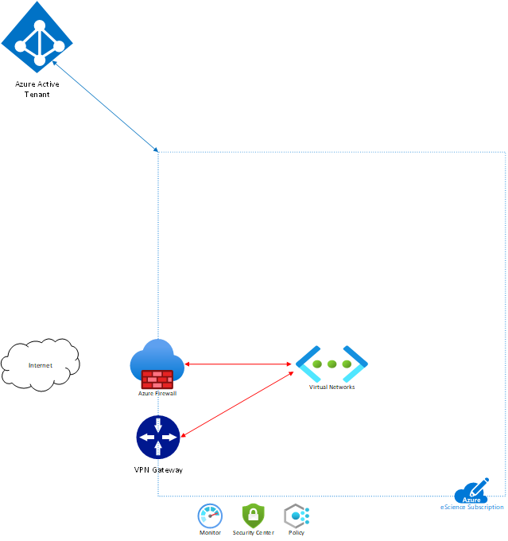
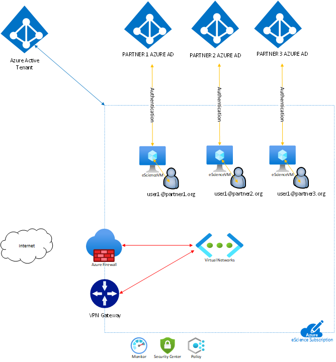

# eScience Prototype

This repo contains scripts to support the eScience project. The concept is as follows:

An Azure subscription is required with a Vnet, access to the Internet and connectivity to the on-premises datacentre.

Standard Platform controls such as Azure Monitor, Azure Security Center and Azure Policy are used to ensure compliance and security requirements are met.

A VM is created in the subscription via an ARM template or similar automation.

A provisioning package is run as part of the VM build to join the VM to the respective partner organisations Azure Active Directory (AAD Join)

The user is then able to log onto the VM with their existing organisation identity and are licensed to use Windows 10. The eScience organisations host and is billed for the usage of the VM. 

This configuration can then be replicated across all of the participating organisations.

Users can log onto the VM over the VPN from the Datacentre LAN

Access to the VM can be provided through a Firewall (DNAT)

Access to the VM can be provided through a load balancer.

To create the provisioning package, please read [this  article](https://docs.microsoft.com/en-us/windows/configuration/provisioning-packages/provisioning-packages)